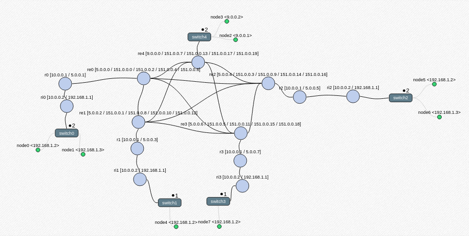
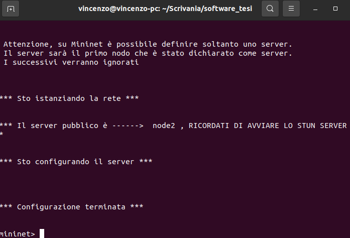
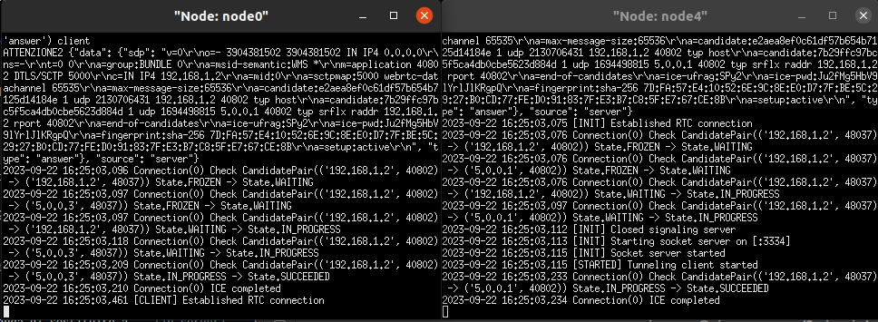

# Emulazione di Overlay Networks in ambiente IoT


## Premessa

Il software è stato testato su Ubuntu 20.04, qualsiasi versione superiore a quella di test può essere utilizzata.
Non sono garantiti invece i risultati per versioni inferiori o per distribuzioni Linux diverse da Ubuntu (Mininet necessita di Ubuntu).


## Setup

Il repository può essere clonato con il seguente comando da eseguire sulla shell
```bash
$ git clone https://github.com/vincenzobucaria/tesi.git
```
Successivamente è possibile avviare il setup con i seguenti comandi
```bash
$ cd tesi
$ chmod +x setup.sh
$ ./setup.sh
```
Il setup provvederà a installare l'ultima versione di mininet e il suo modulo per Python3,
verrà inoltre installato gradle ed i moduli necessari al funzionamento del tunnel-rtc.

Una seconda parte del setup verrà eseguita una volta avviato lo script in python.
Infatti, in caso di primo avvio dello script, questo provvederà ad installare il modulo del kernel che
permetterà a Mininet di emulare il comportamento di NAT definito in RFC 3489 (full cone nat, symmetric nat,
port restricted cone nat, restricted cone nat).


## Definizione della rete

### Caratteristiche generali della rete
E' possibile caratterizzare la rete andando a modificare il file di testo ```network.txt```.
Al momento è presente un limite di 255 nodi istanziabili.
La caratterizzazione permette di scegliere quanti nodi istanziare per ogni LAN,
così come il tipo di NAT che il router di confine della LAN applicherà, mentre la topologia adottata è full-mesh per
quanto riguarda i router che emulano internet. Questo tipo di topologia permette di definire valori di banda e latenza
per ciascun collegamento p2p.

  
Ciascuna LAN privata presenterà un certo numero di nodi (che è possibile definire per mezzo del file) collegati ad uno switch,
a suo volta collegato al router di confine della LAN cui comportamento è quello di un router domestico non applicante NAT.

Il router domestico sarà a sua volta connesso al router del suo ISP, questo applicherà il tipo di NAT definito nel file,
dunque si connetterà ad internet.


Le LAN definite come pubbliche presentano un certo numero di nodi (sempre definibile dal file di testo) collegati ad uno switch,
a sua volta collegato direttamente con un router di frontiera (NON è applicato alcun tipo di NAT).


Di seguito la rappresentazione grafica della rete definita di default nel file




Il nome dei nodi è definibile a piacere, mentre il nome dei vari router e switch è generato automaticamente, i prefissi permettono di identificare la tipologia di router.   
 Con ```ri``` ci si riferisce a ```router domestici```,  
 ```r``` rappresenta il router dell'ISP  
 ```re``` rappresenta un router di frontiera  

### Il file network.txt e la sua struttura

Come già accennato, questo file permette di caratterizzare a piacere la rete.
E' possibile definire fino a 255 nodi, la loro LAN di appartenenza e il tipo di NAT applicato.
1 nodo può inoltre essere definito come server, ciò permette di automatizzare l'avvio del signaling server (lo STUN server dovrà essere avviato manualmente).

<b>La sintassi di ogni riga del file network.txt deve essere la seguente (i parametri tra [ ] sono opzionali:</b>

NODENAME LAN SUBNET_TYPE [SERVER]

<b>NODENAME</b> specifica il nome del nodo <br>
<b>LAN</b> specifica la subnet di appartenenza del nodo <br>
<b>SUBNET_TYPE</b> è un parametro scelto tra [public, full_cone, port_restricted, restricted_cone, symmetric]. Questo parametro viene attribuito alla LAN specificata
alla prima dichiarazione, dichiarazioni incongruenti successive saranno ignorate.
<b>SUBNET_TYPE</b> può essere:
1) <b>public</b>, in questo caso a ogni nodo della sottorete è assegnato un IP pubblico, dunque ogni nodo è raggiungibile dall'esterno.
2) <b>symmetric</b>, ogni nodo ha un ip privato, il router di frontiera implementa il nat simmetrico
3) <b>full_cone</b>, ogni nodo ha un ip privato, il router di frontiera implementa il nat a cono pieno
4) <b>restricted_cone</b>, ogni nodo ha un ip privato, il router di frontiera implementa il nat a cono ristretto
5) <b>port_restricted</b>, ogni nodo ha un ip privato, il router di frontiera implementa il nat a cono ristretto con restrizione sulla porta   


### Il file properties.txt e la sua struttura

Questo file permette di definire la proprietà di connessione tra due LAN, ovvero ne è possibile definire la latenza (RTT)
e banda (espressa in Mbps).

LAN1 LAN2 RITARDO BANDA

1) <b>LAN1</b> specifica la prima LAN target<br>
2) <b>LAN2</b> specifica la seconda LAN target<br>
3) <b>RITARDO</b> specifica la latenza che sussiste tra i router di frontiera delle due LAN target. Il valore è automaticamente inteso in millisecondi (ms)<br>
4) <b>BANDA</b> specifica la massima larghezza di banda disponibile nell'arco che collega le due LAN target. Il valore è automaticamente inteso in Mbps. <br>

Gli archi della rete non impostati possiedono valori di banda e latenza di default.


## Avvio della simulazione

A setup terminato, è possibile avviare lo script mediante il seguente comando da eseguire sulla shell
```bash
$ sudo python3 network-generator.py
```

In caso di errore da parte di Mininet può essere utile un reset mediante
```bash
$ sudo mn -c
$ sudo fuser -k 6653/tcp

```

Poichè al primo avvio in assoluto è necessario installare le estensioni di iptables, il tempo di configurazione potrebbe risultare più lungo.
I successivi avvii dello script avranno tempi regolari.

Durante la fase di avvio vengono descritte le operazioni compiute dal simulatore,
a configurazione ultimata, se è stato definito un nodo come server, ne verrà indicato il nome.


Successivamente sarà possibile interagire via shell con il simulatore (si rimanda a https://github.com/mininet/mininet)




Per verificare il funzionamento del NAT è possibile fare il ping tra un nodo privato e un nodo pubblico.
Ad esempio, utilizzando il file ```network.txt``` di default è possibile eseguire 
```mininet
$ node0 ping node3
```
e osservare se il nodo privato riesce a ragguingere il nodo pubblico. In condizioni di funzionamento standard ciò dovrebbe essere possibile,
è inoltre possibile osservare se i tempi di latenza definiti nel file ```properties.txt```

A scopo di esempio, ecco cosa si dovrebbe ottenere

```mininet> node0 ping node3
PING 9.0.0.2 (9.0.0.2) 56(84) bytes of data.
64 bytes from 9.0.0.2: icmp_seq=1 ttl=60 time=205 ms
64 bytes from 9.0.0.2: icmp_seq=2 ttl=60 time=61.1 ms
64 bytes from 9.0.0.2: icmp_seq=3 ttl=60 time=60.5 ms
64 bytes from 9.0.0.2: icmp_seq=4 ttl=60 time=60.2 ms
64 bytes from 9.0.0.2: icmp_seq=5 ttl=60 time=61.2 ms
```

Accertato che il NAT funzioni, è possibile provare a instaurare il tunnel-rtc
tra due nodi.

Se è stato definito un server nel file, per prima cosa è necessario ottenere l'IP pubblico del signaling server.
Per ottenerlo è sufficiente eseguire il comando 
```bash
$ [nome_server] ifconfig
 ```
Utilizzando il file di default si otterrà:
```
node2-eth0: flags=4163<UP,BROADCAST,RUNNING,MULTICAST>  mtu 1500
        inet 9.0.0.1  netmask 255.255.255.252  broadcast 9.0.0.3
        inet6 fe80::6ccc:b3ff:fe90:fa88  prefixlen 64  scopeid 0x20<link>
        ether 6e:cc:b3:90:fa:88  txqueuelen 1000  (Ethernet)
        RX packets 48  bytes 5643 (5.6 KB)
        RX errors 0  dropped 0  overruns 0  frame 0
        TX packets 11  bytes 866 (866.0 B)
        TX errors 0  dropped 0 overruns 0  carrier 0  collisions 0
```

Dunque l'indirizzo IP del signaling server è ```9.0.0.1```

Adesso è necessario aprire il terminale del server e avviare lo script che opera da server STUN.
Su Mininet è sufficiente eseguire
```bash
$ xterm [nome_server]
 ```
Una volta ottenuta la shell del server, su di questa sarà possibile eseguire
```bash
$ cd stun_server
$ python3 server.py
 ```
A questo punto il server è pienamente configurato. 

Successivamente è possibile aprire il terminale dei due nodi di cui si vorrà istaurare il tunnel.
Sempre dal terminale di mininet, è sufficiente eseguire
```bash
$ xterm [nodo1]
$ xterm [nodo2]
 ```
Ipotizzando che nodo1 sia il server del tunnel-rtc e che nodo2 sia il client, avremo

### Configurazione nodo 1
Una volta aperto xTerm, sarà sufficiente eseguire i seguenti comandi
```bash
$ cd rtc-tunnel-master
$ python3 rtc-tunnel/server.py -w -u http://user:password@[ip server]:8080 -r ws://user:password@[ip server]:8080
```
Si raccomanda di sostituire a ```[ip server]``` l'IP del signaling server (ricavato precedentemente)

### Configurazione nodo 2
Una volta aperto xTerm, sarà sufficiente eseguire i seguenti comandi
```bash
$ cd rtc-tunnel-master
$ python rtc-tunnel/client.py -s [porta sorgente] -d [porta destinazione] -w -u http://user:password@[ip server]:8080 -r ws://user:password@[ip server]:8080
```
Si raccomanda di sostituire a ```[porta sorgente]``` e ```[porta destinazione]``` la porte sorgente e la porta di destinazione del tunnel,
inoltre è necessario sostituire ```[ip server]``` con l'IP del signaling server.

### Verifica del funzionamento 

Se il tunnel-rtc è stato creato correttamente si otterrà un output simile




A questo punto sarà possibile esporre sul ```nodo1v del tunnel un servizio sulla porta destinazione indicata nel comando del client.
Su ```nodo2```, ci si riferirà a ```localhost [porta destinazione]``` per connettersi al nodo server.
Ad esempio, è possibile utilizzare netcat per verificare il funzionamento del tunnel.

## Software di terze parti utilizzati

1) Mininet (https://github.com/mininet/mininet)
2) Moduli per implementare i vari tipi di NAT (https://github.com/xylophone21/netfilter-nattype), si ringrazia pubblicamente l'utente @xylophone21
3) RTC tunnel e signaling server (https://github.com/pcimcioch/rtc-tunnel)
   Precisazione: entrambi sono stati modificati per permetterne il funzionamento su Mininet
4) STUN server (https://github.com/y-i/rfc5389-stun-server-python)


